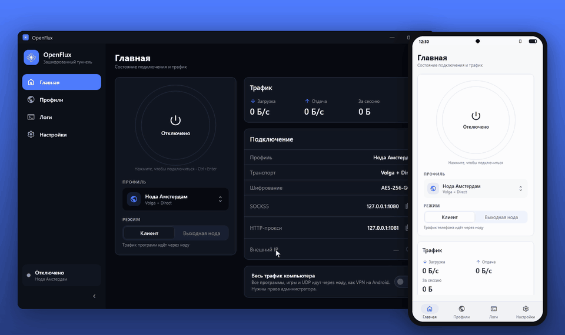
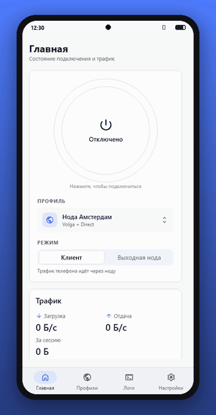
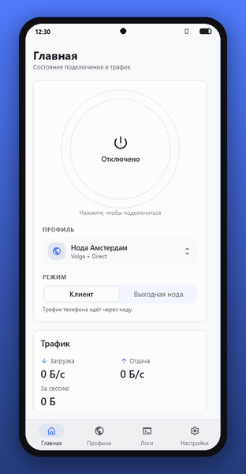
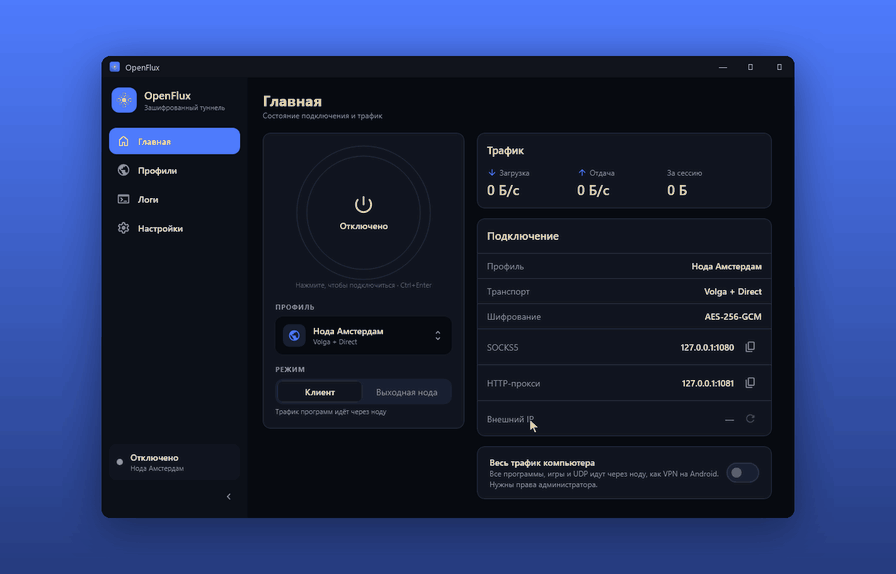
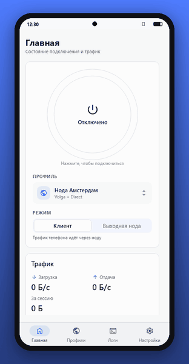

<p align="center">
  
</p>

<h1 align="center">OpenFlux</h1>

<p align="center">
  
  <a href="https://github.com/meepo161/OpenFluxClient/releases/latest"></a>
  <a href="https://github.com/p1neappleXpress/OpenFlux"></a>
</p>

### Свой зашифрованный туннель на компьютере и телефоне — за пару минут

**OpenFlux** — клиент [OpenFlux](https://github.com/p1neappleXpress/OpenFlux) для **Windows, macOS, Linux и Android**: подключение в одно нажатие, профили по ссылке или QR-коду и **своя нода на VDS**, которую приложение ставит само.
**Принимаем PR.**



> [!IMPORTANT]
> **Спасибо [p1neappleXpress](https://github.com/p1neappleXpress)!** Всё, что умеет этот клиент, держится на
> [OpenFlux](https://github.com/p1neappleXpress/OpenFlux): ядре, транспортах и протоколе, которые он придумал и развивает.
> Клиент собирается ровно с его ядром (ветка `hotfix/oflx-encrypted-logging-context`), без собственных правок транспорта.

[Скачать](#-скачать) · [Возможности](#основные-возможности) · [Все функции](#все-возможности) · [Сборка](#-сборка-из-исходников) · [Благодарности](#-благодарности)

---

## Что такое OpenFlux?

OpenFlux прячет трафик в обычные сервисы — документы Яндекса, Mail.ru, MAX и другие — и шифрует его по дороге до вашей ноды. Клиент берёт на себя всё остальное: запускает ядро, показывает, что происходит, поднимает ноду на сервере и раздаёт доступ другим устройствам.

OpenFlux работает на:

- **Windows** 10 и 11 (x64)
- **macOS** — Apple Silicon и Intel
- **Linux** x64 — Debian, Ubuntu и другие
- **Android** 8.0 и новее

Особенности платформ:

- **Windows** — системный прокси включается сам, режим «Весь трафик» пускает через ноду все программы и UDP (адаптер Wintun).
- **Android** — VPN для всего телефона, QR-коды камерой, та же нода и те же профили, что на компьютере.
- **macOS и Linux** — SOCKS5 и HTTP-прокси на `127.0.0.1`.

> [!NOTE]
> Демо ниже записаны с настоящих экранов приложения — тех же, что в сборках для Windows и Android, — на выдуманных данных: профили, ключи и адреса ненастоящие.

---

# Основные возможности

## Подключение в одно нажатие
Большая кнопка на главной и живой статус от ядра: подключено или переподключается, скорость, объём за сессию, активный транспорт и внешний IP. На Windows прокси включается сам и возвращается как было после отключения.

<table>
<tr><th>Windows</th><th>Android</th></tr>
<tr>
<td></td>
<td></td>
</tr>
</table>

## Профили по ссылке и QR-коду
Владелец ноды присылает ссылку `openflux://` или QR-код — профиль появляется одним нажатием, со всеми транспортами, приоритетами и ключом. На Android код можно отсканировать камерой, на компьютере — вставить из буфера или картинки.

<table>
<tr><th>Windows</th><th>Android</th></tr>
<tr>
<td></td>
<td></td>
</tr>
</table>

## Своя нода на VDS за четыре шага
Сервер, документ, изменения, проверка. Мастер заходит на сервер по SSH, сам создаёт документ в Яндексе, показывает, что сделает, ставит канал и проверяет, что трафик выходит с адреса сервера. Потом профиль сохраняется или уходит другому устройству QR-кодом.

<table>
<tr><th>Windows</th><th>Android</th></tr>
<tr>
<td></td>
<td></td>
</tr>
</table>

Мастер ставит на сервер **отдельный канал** со своим документом, ключом, портом и systemd-юнитом. Запустите его ещё раз на том же сервере — появится ещё один независимый канал для другого пользователя, существующие не изменятся.

1. **Сервер.** Адрес, SSH-порт, логин, пароль или ключ. Отпечаток ключа сервера показывается для сверки и запоминается: подмена ключа не пройдёт молча.
2. **Документ.** Вход в Яндекс во встроенном браузере: мастер сам создаёт документ с доступом «Редактирование» по ссылке. Имя документа — название ноды, дата и случайные буквы, без адреса сервера. Можно вставить и свою ссылку.
3. **Изменения.** Сервер показывает, что именно будет сделано; для `sudo` спрашивается пароль.
4. **Проверка.** Мастер подключается через новую ноду и сравнивает внешний IP с адресом сервера. Профиль сохраняется или отдаётся другому устройству QR-кодом.

Нужен Linux с systemd (Debian, Ubuntu и похожие) и root или `sudo`. Скрипт установки скачивается по закреплённому коммиту и проверяется по SHA-256, ядро ноды — по закреплённым хешам воспроизводимой сборки.

## Журнал, который читается
Что делает ядро — по строкам: транспорты, шифрование, соединения. Поиск, фильтр важного, уровни подробности, скрытие ключей и ссылок.

<table>
<tr><th>Windows</th><th>Android</th></tr>
<tr>
<td></td>
<td></td>
</tr>
</table>

---

## Все возможности

### Подключение

- Подключение и отключение одной кнопкой (<kbd>Ctrl</kbd>+<kbd>Enter</kbd> на компьютере)
- Живой статус от ядра: состояние, время, скорость, объём, активный транспорт
- Внешний IP — видно, что трафик выходит с ноды
- Режим Session: несколько транспортов сразу, переключение по приоритету
- Шифрование AES-256-GCM с отдельным ключом на каждый канал
- Автоподключение при запуске

### Режимы работы

- **Windows:** системный прокси — включается сам, прежние настройки возвращаются при отключении, выходе и после сбоя
- **Windows:** весь трафик компьютера через Wintun — любые программы, игры и UDP; IPv6 блокируется, чтобы ничего не утекало
- **Android:** VPN для всего телефона или только локальный прокси
- SOCKS5 и HTTP-прокси на `127.0.0.1` для своих программ
- Выходная нода: устройство само выпускает в интернет других, QR-код для клиентов на главной

### Профили

- Импорт ссылок `openflux://` и QR-кодов: камерой (Android), из буфера, из файла или картинки
- Ручное создание: Яндекс Документы (обычные и Volga), Яндекс Доски, Mail.ru, MAX, Cups.online, прямое TCP-подключение
- Поиск, дублирование, удаление, свои иконки
- «QR и ссылка» — отдать профиль другому устройству

### Своя нода

- Установка канала на VDS по SSH: пароль или ключ, `sudo`
- Отпечаток ключа сервера показывается и запоминается — подмена не пройдёт молча
- Документ в Яндексе создаётся сам; имя — название ноды, дата и случайные буквы
- Несколько независимых каналов на одном сервере: свой документ, ключ, порт и systemd-юнит у каждого
- Установщик по закреплённому коммиту с проверкой SHA-256, ядро ноды — по хешам воспроизводимой сборки
- Проверка после установки: подключение через новую ноду и сравнение внешнего IP с адресом сервера

### Встроенный браузер и проверки Яндекса

- Вход в Яндекс прямо в приложении — Chromium на компьютере, WebView на Android
- Капча, которую просит нода, открывается с адреса ноды — пройти её можно у себя
- Кэш в памяти, cookies стираются после каждого использования

### Интерфейс

- Светлая и тёмная тема
- Адаптивная раскладка: окно любой ширины, телефон, планшет
- Трей, горячие клавиши, контекстные меню, полосы прокрутки на компьютере
- Крупные элементы и жесты на Android
- Проверка обновлений в настройках

---

## 📦 Скачать

Все сборки лежат в одном релизе: **[Releases → последний](https://github.com/meepo161/OpenFluxClient/releases/latest)**. Рядом `SHA256SUMS.txt` для проверки.

| Система | Файл | Что это |
|---|---|---|
| 🪟 **Windows** 10/11 x64 | `OpenFlux-X.Y.Z-windows-x64.msi` | Установщик для одного пользователя, без прав администратора |
| | `OpenFlux-X.Y.Z-windows-x64-setup.exe` | То же в виде `.exe` |
| | `OpenFlux-X.Y.Z-windows-x64-portable.zip` | Без установки: распакуйте и запустите `OpenFlux.exe` |
| 🍎 **macOS** | `OpenFlux-X.Y.Z-macos-arm64.dmg` | Apple Silicon (M1 и новее) |
| | `OpenFlux-X.Y.Z-macos-x64.dmg` | Intel |
| 🐧 **Linux** x64 | `OpenFlux-X.Y.Z-linux-x64.deb` | Debian, Ubuntu, Mint: `sudo apt install ./OpenFlux-X.Y.Z-linux-x64.deb` |
| | `OpenFlux-X.Y.Z-linux-x64.tar.gz` | Любой дистрибутив: распакуйте и запустите `OpenFlux/bin/OpenFlux` |
| 🤖 **Android** 8.0+ | `OpenFlux-X.Y.Z-android-…-arm64-v8a-release.apk` | Почти все современные телефоны |
| | `…-armeabi-v7a-release.apk` | Старые 32-битные телефоны |
| | `…-universal-release.apk` | Если не уверены — подходит всем, но весит больше |

Ядро OpenFlux (и `wintun.dll` в Windows) уже внутри. Встроенный браузер на компьютере (~230 МБ) скачивается с CDN JetBrains при первом входе в Яндекс.

> [!TIP]
> **macOS:** сборки не подписаны — при первом запуске откройте приложение через правый клик → «Открыть».
> **Android:** APK из релиза обновляет прежнюю версию из релизов. Сборку, сделанную самостоятельно, сначала удалите — у неё другая подпись.

## 🚀 Быстрый старт

1. **Есть ссылка или QR от владельца ноды** → «Профили» → «Импорт» → вставьте `openflux://…`, выберите картинку с QR или отсканируйте камерой.
2. **Есть свой VDS** → «Профили» → «+» → «Создать свою ноду на VDS» ([как это работает](#-своя-нода-на-vds)).
3. Нажмите большую кнопку на главной. Внешний IP в карточке «Подключение» должен смениться на адрес ноды.

<details>
<summary><b>Какой режим выбрать на компьютере</b></summary>

| Режим | Что идёт через ноду | Права администратора |
|---|---|---|
| **Системный прокси** (по умолчанию) | Браузеры и большинство программ, которые смотрят на прокси Windows | Не нужны |
| **Весь трафик компьютера** | Всё: любые программы, игры, UDP. IPv6 блокируется, чтобы ничего не утекало мимо туннеля | Нужны: на главной есть кнопка «Перезапустить от имени администратора» |
| **Только SOCKS5 / HTTP** | Программы, которым вы сами указали `127.0.0.1:1080` (SOCKS5) или `:1081` (HTTP) | Не нужны |

</details>

## 🔒 Конфиденциальность

- **Пароли SSH и sudo, приватный ключ** живут только в памяти на время мастера и нигде не сохраняются.
- **Встроенный браузер** держит кэш в памяти и стирает cookies после каждого использования; вход в Яндекс остаётся только в cookies, переданных ноде (от этого можно отказаться на шаге «Изменения»).
- **Ключ канала и `.conf`** пишутся на диск только на время подключения; журнал по умолчанию скрывает ключи и ссылки на документы.

Где лежат данные на Windows: `%APPDATA%\OpenFlux` — профили и настройки; `%LOCALAPPDATA%\OpenFlux` — встроенный браузер и его журналы `browser.log` / `browser-cef.log`.

<details>
<summary><b>Горячие клавиши</b></summary>

| | |
|---|---|
| <kbd>Ctrl</kbd>+<kbd>1</kbd>…<kbd>4</kbd> | Разделы |
| <kbd>Ctrl</kbd>+<kbd>Enter</kbd> | Подключить / отключить |
| <kbd>Ctrl</kbd>+<kbd>N</kbd> | Новый профиль |
| <kbd>Ctrl</kbd>+<kbd>I</kbd> | Импорт ссылки или QR |
| <kbd>Ctrl</kbd>+<kbd>S</kbd> | Сохранить |
| <kbd>Esc</kbd> / <kbd>Enter</kbd> | Отмена / главная кнопка диалога |

</details>

## 🧩 Ядро

Клиент собирает ядро из [`meepo161/openfluxfork`](https://github.com/meepo161/openfluxfork) (ветка `fork-main`). Это ядро [p1neappleXpress/OpenFlux](https://github.com/p1neappleXpress/OpenFlux) из ветки `hotfix/oflx-encrypted-logging-context` как есть, плюс:

- `mobile/` — мост gomobile, из которого собирается `openflux.aar` для Android-приложения;
- закреплённый установщик ноды (`deploy/node-install.sh`, `provision/pin.go`) и согласованные релизы.

## 🛠️ Сборка из исходников

Нужны JDK 17, Go и git; для Android — ещё Android SDK с NDK 27 и `gomobile`.

Файлов ядра в git нет. `run` и `package*` сами собирают ядро для этой системы в `desktopApp/resources/<windows|macos|linux>` (для Windows ещё скачивают `wintun.dll` с проверкой SHA-256), если его там ещё нет: из `-PcoreDir=<путь>`, из `../OpenFlux` рядом с репозиторием или из свежего клона `fork-main`. Чтобы пересобрать ядро, удалите его из `resources/<os>`; `-PskipCore=true` запускает приложение без ядра.

```bash
./gradlew :desktopApp:run                              # запустить (ядро соберётся при первом запуске)
scripts/build-core.sh ../OpenFlux                      # ядро вручную, в т. ч. в Docker без Go
scripts/build-android-core.sh ../OpenFlux              # openflux.aar для Android
./gradlew :shared:jvmTest                              # тесты
./gradlew :androidApp:assembleDebug                    # Android: APK
./gradlew -PwindowsPackage=true :desktopApp:packageMsi # Windows: .msi (и packageExe)
./gradlew :desktopApp:packageDmg                       # macOS: .dmg
./gradlew :desktopApp:packageDeb                       # Linux: .deb (нужен fakeroot)
OPENFLUX_DEMO=build/demo ./gradlew :desktopApp:test --tests "*DemoRecorder*"  # кадры демо с настоящих экранов
python scripts/demo-gifs.py build/demo docs/media      # GIF для этого README (нужен Pillow)
```

В настройках можно указать и свой файл ядра — `wintun.dll` должен лежать рядом с ним.

<details>
<summary><b>Как выходят релизы</b></summary>

Версия задаётся одним тегом `vX.Y.Z` в [`meepo161/openfluxfork`](https://github.com/meepo161/openfluxfork):

```bash
git tag -a v2.5.0 -m "OpenFlux 2.5.0" && git push origin v2.5.0   # в репозитории ядра
```

Workflow ядра запускает здесь [`release.yml`](.github/workflows/release.yml) с этим тегом как неизменяемым `core_ref`. Он собирает Windows x64, Linux x64, macOS Apple Silicon и Intel, Android APK — каждый с ядром из этого тега — и публикует всё одним релизом с `SHA256SUMS.txt`. После этого ядро публикует свой релиз с бинарниками выходной ноды того же номера. Для этого у ядра должен быть секрет `CLIENT_RELEASE_TOKEN` с правом **Actions: write** к этому репозиторию.

Перед публикацией каждая сборка проверяет, что в пакет попали нативные библиотеки Skia для своей платформы, ядро и `wintun.dll`. Ручной запуск («Run workflow») с `publish=false` собирает проверочные артефакты без релиза.

</details>

<details>
<summary><b>Устройство</b></summary>

```
desktopApp/        окно, трей, горячие клавиши, упаковка, иконки (icons/openflux.svg)
androidApp/        Android: VPN-сервис, WebView, камера, ядро через openflux.aar
shared/
  commonMain/      модели (Profile, CoreConfig, ConnectionState, NodeWizard),
                   интерфейсы сервисов, дизайн-система и экраны — общие для всех платформ
  jvmMain/
    core/          запуск ядра, IPC-статус, проверки Яндекса
    node/          мастер своей ноды (ядро --node-wizard по stdin/stdout)
    web/           встроенный браузер: KCEF off-screen, прокси-маршрутизатор, журнал
    platform/      системный прокси Windows (WinINet), права администратора
    data/          хранение настроек и профилей
```

Поток данных: экран → `ScreenModel` (Voyager) → сервисы; UI не трогает ни файлы, ни процессы.

На компьютере ядро — отдельный Go-процесс: SOCKS5 и HTTP-прокси на `127.0.0.1` или адаптер Wintun, статус и проверки Яндекса по IPC. В режиме «Весь трафик» сокеты самого ядра привязаны к физическому интерфейсу, поэтому транспорты не зацикливаются в собственный туннель. На Android то же ядро работает внутри приложения как библиотека.

</details>

## 💙 Благодарности

- **[p1neappleXpress](https://github.com/p1neappleXpress)** — автор [OpenFlux](https://github.com/p1neappleXpress/OpenFlux): ядра, транспортов через Яндекс, Mail.ru, MAX и другие сервисы, шифрования и протокола согласования, а также [OpenFluxAndroid](https://github.com/p1neappleXpress/OpenFluxAndroid). Без его работы этого клиента бы не было — спасибо!
- **[damnurmum](https://github.com/damnurmum)** — автор [OpenFlux-Android](https://github.com/damnurmum/OpenFlux-Android) и улучшений ядра: ссылки и QR-коды `openflux://`, новый протокол cups.online.
- Всем, кто присылал ошибки, тестировал ноды и транспорты и отправлял PR в OpenFlux.

Мейнтейнер клиента — **[@meepo161](https://github.com/meepo161)**. Вопросы, ошибки и предложения — в [Issues](https://github.com/meepo161/OpenFluxClient/issues).

## ⚖️ Отказ от ответственности

OpenFlux — исследовательский сетевой инструмент. Проект некоммерческий, без платных функций. Используйте его в рамках законов и правил сервисов, с которыми он работает; ответственность за применение лежит на пользователе.
