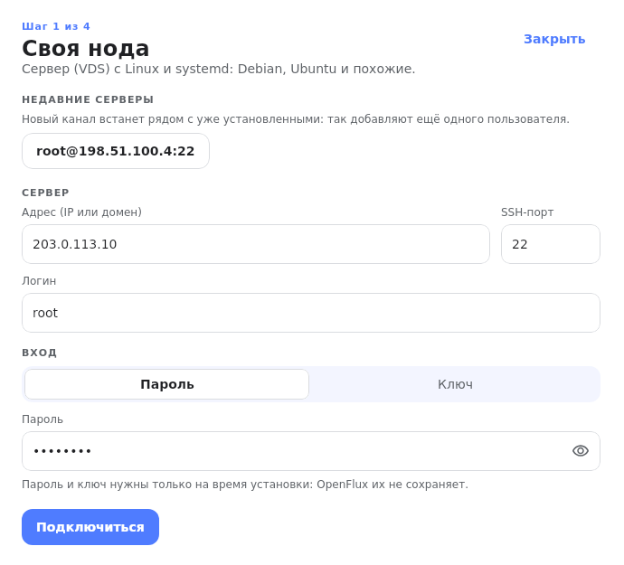
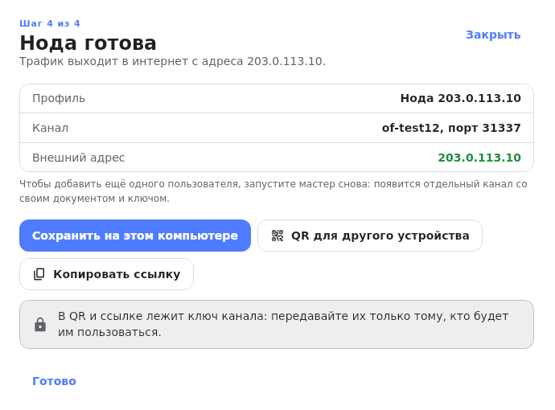

<div align="center">

# OpenFlux для компьютера

**Настольный клиент [OpenFlux](https://github.com/p1neappleXpress/OpenFlux) для Windows:
профили, своя нода на VDS в пару кликов и весь трафик компьютера через туннель.**

[](https://github.com/meepo161/openfluxfordesktop/actions/workflows/release.yml)
[](https://github.com/meepo161/openfluxfordesktop/releases/latest)


[Скачать](#скачать) · [Возможности](#возможности) · [Своя нода](#своя-нода-на-vds) · [Сборка](#сборка-из-исходников) · [Устройство](#устройство)

</div>

> [!NOTE]
> Мейнтейнер клиентского приложения — **[@meepo161](https://github.com/meepo161)**.
> Вопросы, ошибки и предложения — в [Issues](https://github.com/meepo161/openfluxfordesktop/issues).

---

## Возможности

| | |
|---|---|
| 🔌 **Подключение в один клик** | Большая кнопка на главной, живой статус от ядра: подключено или переподключается, скорость, объём, активный транспорт, внешний IP. |
| 🌐 **Весь трафик компьютера** | Режим TUN на Wintun, как VPN на Android: браузеры, игры, мессенджеры и UDP идут через ноду. |
| 🧭 **Системный прокси Windows** | Включается сам при подключении, прежние настройки возвращаются при отключении, выходе и после сбоя. |
| 🛰️ **Своя нода на VDS** | Мастер ставит канал на ваш сервер по SSH, сам создаёт документ в Яндексе и проверяет, что трафик выходит с адреса сервера. |
| 🧾 **Профили** | Импорт `openflux://` и QR-кодов (из файла или буфера), ручное создание, режим Session с несколькими транспортами и приоритетами. |
| 🔎 **Встроенный браузер** | Вход в Яндекс и его проверки внутри приложения (Chromium через KCEF); проверки ноды открываются с её адреса. |
| 🖥️ **Выходная нода** | Этот компьютер выпускает в интернет других, QR-код для клиентов на главной. |
| 📜 **Журнал** | Поиск, фильтр, скрытие ключей и ссылок; отдельный журнал встроенного браузера. |

Ещё: трей, светлая и тёмная тема, три ширины окна, горячие клавиши, полосы прокрутки, контекстные меню — программа ведёт себя как настольная, а не как растянутый телефон.

## Скачать

Готовые сборки — на странице [Releases](https://github.com/meepo161/openfluxfordesktop/releases/latest):

| Файл | Что это |
|---|---|
| `OpenFlux-X.Y.Z-windows-x64.msi` | Установщик для одного пользователя, без прав администратора |
| `OpenFlux-X.Y.Z-windows-x64-setup.exe` | То же, в виде `.exe` |
| `OpenFlux-X.Y.Z-windows-x64-portable.zip` | Без установки: распакуйте и запустите `OpenFlux.exe` |

Ядро OpenFlux и `wintun.dll` уже внутри. Встроенный браузер (~230 МБ) скачивается с CDN JetBrains при первом входе в Яндекс.

## Быстрый старт

1. **Есть ссылка или QR от владельца ноды** → «Профили» → «Импорт» (<kbd>Ctrl</kbd>+<kbd>I</kbd>) → вставьте `openflux://…` или картинку с QR.
2. **Есть свой VDS** → «Профили» → «+» → «Создать свою ноду на VDS» (см. [ниже](#своя-нода-на-vds)).
3. На главной нажмите большую кнопку (<kbd>Ctrl</kbd>+<kbd>Enter</kbd>). Внешний IP в карточке «Подключение» должен смениться на адрес ноды.

### Какой режим выбрать

| Режим | Что идёт через ноду | Права администратора |
|---|---|---|
| **Системный прокси** (по умолчанию) | Браузеры и большинство программ, которые смотрят на прокси Windows | Не нужны |
| **Весь трафик компьютера** | Всё: любые программы, игры, UDP. IPv6 блокируется, чтобы ничего не утекало мимо туннеля | Нужны — на главной есть кнопка «Перезапустить от имени администратора» |
| **Только SOCKS5 / HTTP** | Программы, которым вы сами указали `127.0.0.1:1080` (SOCKS5) или `:1081` (HTTP) | Не нужны |

## Своя нода на VDS

<table>
<tr>
<td width="50%"></td>
<td width="50%"></td>
</tr>
</table>

Мастер ставит на сервер **отдельный канал** — со своим документом, ключом, портом и systemd-юнитом. Запустите его ещё раз на том же сервере — появится ещё один независимый канал для другого пользователя; существующие не меняются.

1. **Сервер.** Адрес, SSH-порт, логин, пароль или ключ. Отпечаток ключа сервера показывается для сверки и запоминается; подмена ключа не пройдёт молча.
2. **Документ.** Вход в Яндекс во встроенном браузере — мастер сам создаёт папку `openflux`, документ и доступ «Редактирование» по ссылке. Можно вставить и свою ссылку.
3. **Изменения.** Сервер показывает, что именно будет сделано; для `sudo` спрашивается пароль.
4. **Проверка.** Мастер подключается через новую ноду и сравнивает внешний IP с адресом сервера. Потом профиль сохраняется или отдаётся другому устройству QR-кодом.

Нужен Linux с systemd (Debian, Ubuntu и похожие) и root или `sudo`. Скрипт установки скачивается по закреплённому коммиту и проверяется по SHA-256.

## Конфиденциальность

- **Пароли SSH и sudo, приватный ключ** живут только в памяти на время мастера и нигде не сохраняются.
- **Встроенный браузер** хранит кэш в памяти и стирает cookies после каждого использования; вход в Яндекс остаётся только в cookies, переданных ноде (от этого можно отказаться на шаге «Изменения»).
- **Ключ канала и `.conf`** пишутся в `runtime` только на время подключения; журнал по умолчанию скрывает ключи и ссылки на документы.

Данные: `%APPDATA%\OpenFlux` — профили и настройки; `%LOCALAPPDATA%\OpenFlux` — встроенный браузер и его журналы `browser.log` / `browser-cef.log`.

## Горячие клавиши

| | |
|---|---|
| <kbd>Ctrl</kbd>+<kbd>1</kbd>…<kbd>4</kbd> | Разделы |
| <kbd>Ctrl</kbd>+<kbd>Enter</kbd> | Подключить / отключить |
| <kbd>Ctrl</kbd>+<kbd>N</kbd> | Новый профиль |
| <kbd>Ctrl</kbd>+<kbd>I</kbd> | Импорт ссылки или QR |
| <kbd>Ctrl</kbd>+<kbd>S</kbd> | Сохранить |
| <kbd>Esc</kbd> / <kbd>Enter</kbd> | Отмена / главная кнопка диалога |

## Сборка из исходников

Нужны JDK 17, Go (для ядра) и `curl` + `unzip`.

```bash
# 1. Ядро и wintun.dll в desktopApp/resources/windows
git clone -b desktop-core https://github.com/meepo161/openfluxandroidfork ../openfluxandroidfork
scripts/build-core.sh ../openfluxandroidfork        # Go в Docker; или соберите ядро сами, см. скрипт

# 2. Приложение
./gradlew :desktopApp:run                           # запустить
./gradlew :shared:jvmTest                           # тесты
./gradlew -PwindowsPackage=true :desktopApp:packageMsi   # установщик
```

В настройках можно указать и свой файл ядра — `wintun.dll` должен лежать рядом с ним.

### Релизы

Релиз собирается сам: достаточно запушить тег.

```bash
git tag v2.1.0 && git push origin v2.1.0
```

Workflow [`release.yml`](.github/workflows/release.yml) на `windows-2022` собирает ядро из [`meepo161/openfluxandroidfork`](https://github.com/meepo161/openfluxandroidfork), кладёт рядом официальный `wintun.dll` (с проверкой SHA-256), прогоняет тесты, собирает `.msi`, `.exe` и портативный `.zip` и публикует их в Releases вместе с `SHA256SUMS.txt`. Перед публикацией он проверяет, что в пакет попали нативные библиотеки Skia для Windows (`skiko-awt-runtime-windows-x64`) — без них окно не нарисуется, а сборка при этом не упадёт; флаг `-PwindowsPackage=true` добавляет их, даже если собирать не на Windows.

Ветку или коммит ядра можно задать переменными репозитория `CORE_REPO` / `CORE_REF` или при ручном запуске («Run workflow»).

## Устройство

```
desktopApp/        окно, трей, горячие клавиши, упаковка
shared/
  commonMain/      модели (Profile, CoreConfig, ConnectionState, NodeWizard),
                   интерфейсы сервисов, дизайн-система и экраны
  jvmMain/
    core/          запуск ядра, IPC-статус, проверки Яндекса
    node/          мастер своей ноды (ядро --node-wizard по stdin/stdout)
    web/           встроенный браузер: KCEF off-screen, прокси-маршрутизатор, журнал
    platform/      системный прокси Windows (WinINet), права администратора
    data/          хранение в %APPDATA%\OpenFlux
```

Поток данных: экран → `ScreenModel` (Voyager) → сервисы. UI не трогает ни файлы, ни процессы.

Ядро — отдельный Go-процесс: SOCKS5 и HTTP-прокси на `127.0.0.1` или адаптер Wintun, статус и проверки Яндекса по IPC. В режиме «Весь трафик» сокеты самого ядра привязаны к физическому интерфейсу, поэтому транспорты не зацикливаются в собственный туннель.

## Связанные проекты

- [**OpenFlux**](https://github.com/p1neappleXpress/OpenFlux) — ядро и транспорты, автор [p1neappleXpress](https://github.com/p1neappleXpress)
- [**OpenFluxAndroid**](https://github.com/p1neappleXpress/OpenFluxAndroid) — Android-клиент, автор [p1neappleXpress](https://github.com/p1neappleXpress)
- [**openfluxandroidfork**](https://github.com/meepo161/openfluxandroidfork) — Android-клиент с мастером нод и ядро, которое собирает этот клиент

Спасибо p1neappleXpress за OpenFlux и оригинальные клиенты.

## Отказ от ответственности

OpenFlux — исследовательский сетевой инструмент. Проект некоммерческий, без платных функций. Используйте его в рамках законов и правил сервисов, с которыми он работает; ответственность за применение лежит на пользователе.
